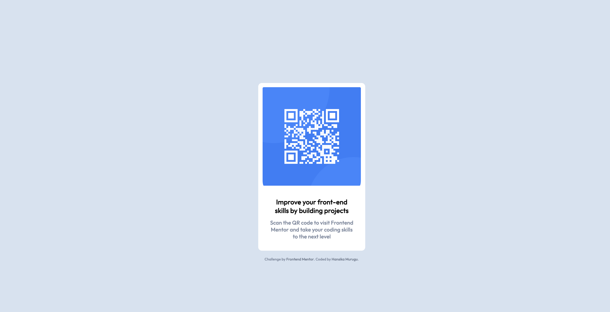

# QR-Code-Component
<h1 align="center">QR Code Component</h1>

  <h3>
    <a href="https://hmurugu.github.io/QR-Code-Component/" color="white">
      Live
    </a>
     | 
    <a href="https://www.frontendmentor.io/solutions/qr-code-component-using-css-oGHm3EoWfe">
      Solution
    </a>
    | 
    <a href="https://www.frontendmentor.io/challenges/qr-code-component-iux_sIO_H">
      Challenge
    </a>
  </h3>

   Solution for a challenge from  <a href="https://www.frontendmentor.io/" target="_blank">frontendmentor.io</a>.

 
 
 

## Table of contents

- [Overview](#overview)
- [Built with](#built-with)

### Overview

The challenge is to build out QR code component and get it looking as close to the design as possible.

### Built with

- HTML
- CSS

 hmurugu 2022 

